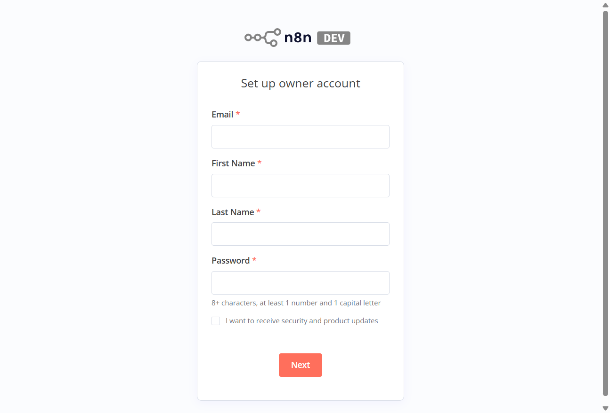

# n8n Desktop Installer

**A simple one-click installer for n8n - No technical knowledge required!**

n8n Desktop Installer makes it easy for non-technical users to install and run n8n automation workflows on their Windows computer. No Docker, no terminal commands, no configuration needed - just click install and start automating!



## 🎯 Purpose

Created to help students, educators, and beginners learn n8n automation without the complexity of traditional installation methods. Perfect for workshops, training sessions, and classroom environments.

## Features

- **One-click installation** - No Docker, no command line required
- **Bundled n8n** - n8n is included in the installer, no separate download needed
- **System tray interface** - Start/Stop/Restart n8n from the tray icon
- **Auto-start** - n8n starts automatically when the app launches
- **Browser integration** - Automatically opens your browser to n8n
- **Persistent data** - Your workflows and credentials are stored locally

## Requirements

- Windows 10/11 (64-bit) or macOS 10.15+
- 4GB RAM minimum (8GB recommended)
- 2GB free disk space

## Installation

### For End Users (From Release)

1. Download the latest installer from the [Releases](https://github.com/lerlerchan/n8n_Desktop_installer/releases) page
2. Run the installer (`.exe` for Windows, `.dmg` for macOS)
3. Follow the installation wizard
4. n8n Desktop will start automatically and open your browser

### For Developers (From Source)

```bash
# Clone the repository
git clone https://github.com/lerlerchan/n8n_Desktop_installer.git
cd n8n_Desktop_installer

# Install dependencies (lightweight Electron shell only)
npm install

# Also install n8n for local development
npm install n8n

# Run in development mode
npm run dev

# Build Windows installer
npm run build:win

# Build macOS installer (on macOS only)
npm run build:mac
```

## Architecture

The app bundles n8n directly within the Electron application:

```
┌─────────────────────────────────────────────────────────────┐
│  Electron Desktop App                                        │
│     - System tray UI                                         │
│     - Process management (respawn for auto-restart)          │
│     - Bundled n8n in node_modules/n8n/                       │
│     - Health check monitoring                                │
└─────────────────────────────────────────────────────────────┘
```

n8n is included as a production dependency and packaged directly into the installer. The build uses `npmRebuild: false` to preserve pre-built native binaries.

## Building

### Build the Installer

```bash
# Install dependencies
npm install

# Build Windows installer
npm run build:win

# Output: dist/n8n Desktop Setup*.exe
```

The build bundles n8n and all its dependencies into the installer. The `npmRebuild: false` setting ensures pre-built native modules are preserved as-is.

## CI/CD Workflows

### `.github/workflows/release.yml`
- Triggers on push to main or manually
- Builds n8n runtime on Windows with Node.js 20.x
- Builds the Electron installer
- Creates a GitHub Release with the installer and runtime zip
- Supports specifying a custom n8n version via workflow input

## Usage

### System Tray Menu

Right-click the n8n icon in your system tray to access:

- **Start n8n** - Start the n8n server
- **Stop n8n** - Stop the n8n server
- **Restart n8n** - Restart the n8n server
- **Open in Browser** - Open n8n in your default browser
- **Quit** - Stop n8n and exit the application

### Status Indicators

- **Green icon** - n8n is running
- **Gray icon** - n8n is stopped

### Accessing n8n

Once started, n8n is available at: `http://localhost:5678`

## Data Storage

All n8n data is stored in your home directory:

- **Windows**: `C:\Users\<username>\.n8n\`
- **macOS**: `~/.n8n/`

This includes:
- `database.sqlite` - Workflows, credentials, and execution history
- `config` - n8n configuration
- `n8n-desktop.env` - Desktop app settings

## Configuration

### Custom Port

Edit `~/.n8n/n8n-desktop.env` and set:
```
N8N_PORT=5679
```

## Troubleshooting

### n8n won't start

1. Check if port 5678 is already in use (use `netstat -ano | findstr 5678` on Windows)
2. Check the application logs in `~/.n8n/n8n-desktop-logs/`
3. Try restarting the application from the system tray
4. Verify the n8n binary exists inside the installation directory at `resources/app/node_modules/n8n/bin/`

### n8n binary not found

If you see "n8n binary not found" on startup:
1. The installation may be corrupt - try reinstalling the application
2. Check that antivirus software hasn't quarantined files in the installation directory
3. The n8n binary should be at: `<install-dir>/resources/app/node_modules/n8n/bin/n8n.cmd` (Windows)

### Port conflict

If port 5678 is in use, change it by editing `~/.n8n/n8n-desktop.env`:
```
N8N_PORT=5679
```

### Application crashes

1. Check the application logs at `~/.n8n/n8n-desktop-logs/`
2. Ensure you have at least 1GB of free RAM
3. On Windows, try running as administrator if permission errors occur

### Build issues (developers)

- **Native module rebuild errors**: The build uses `npmRebuild: false` to avoid rebuilding native modules. If you encounter issues with native dependencies, ensure `npm install` completed successfully before building.
- **Missing .bin symlinks**: In the packaged app, `.bin` symlinks are not created by electron-builder. The app uses direct paths to `node_modules/n8n/bin/` instead.

## Project Structure

```
n8n_Desktop_installer/
├── .github/
│   └── workflows/
│       └── release.yml          # Build and release CI
├── main/
│   ├── index.js                 # Main Electron process
│   ├── tray.js                  # System tray implementation
│   ├── n8nProcess.js            # n8n process management
│   ├── envConfig.js             # Environment configuration
│   ├── logger.js                # Application logging
│   └── utils.js                 # Utility functions
├── preload/
│   └── preload.js               # Preload script for IPC
├── renderer/
│   └── index.html               # Optional UI
├── assets/                      # Icons and images
├── build/                       # Build configuration
└── package.json                 # Dependencies and build config
```

## Scripts

| Script | Description |
|--------|-------------|
| `npm start` | Run the application |
| `npm run dev` | Run in development mode |
| `npm run build:win` | Build Windows installer (NSIS) |
| `npm run build:mac` | Build macOS installer (DMG) |
| `npm run rebuild` | Rebuild native Electron dependencies |

## License

### n8n Desktop Installer (This Project)

The n8n Desktop Installer wrapper code is licensed under the **MIT License** - see [LICENSE](LICENSE) file for details.

### n8n (Bundled Software)

**n8n** is licensed under the [Sustainable Use License](https://github.com/n8n-io/n8n/blob/master/LICENSE.md) by n8n GmbH.

**Permitted Uses:**
- Non-commercial and personal use
- Educational and learning purposes
- Internal business use
- Free distribution for non-commercial purposes

**Restrictions:**
- Commercial redistribution is prohibited without a separate license from n8n GmbH
- Enterprise features (files with ".ee." in the name) require an n8n Enterprise License

By using this installer, you agree to comply with n8n's Sustainable Use License.

### Disclaimer

This is an independent community project for educational purposes. It is **not** officially affiliated with or endorsed by n8n GmbH.

---

**Made with ❤️ for educators and students**

*No more "Docker not found" errors in your workshops!*

## Changelog

### v1.0.2 (Latest)
- Added sqlite3 as explicit dependency for native module support
- Fixed health check IPv4/IPv6 mismatch issue (now uses 127.0.0.1 explicitly)

### v1.0.1
- Fixed: n8n module not included in packaged app
- Fixed: Binary path issue in production builds (`.bin` symlinks not created by electron-builder)
- Added: Disabled `npmRebuild` to prevent native module conflicts

### v1.0.0
- Initial release
- One-click Windows installer with bundled n8n
- System tray interface for start/stop/restart
- Auto-start functionality
- Browser integration

## Credits and 🙏 Acknowledgments

- [n8n](https://n8n.io/) - Workflow automation platform
- [Electron](https://www.electronjs.org/) - Desktop application framework
- [electron-builder](https://www.electron.build/) - Build and distribution
